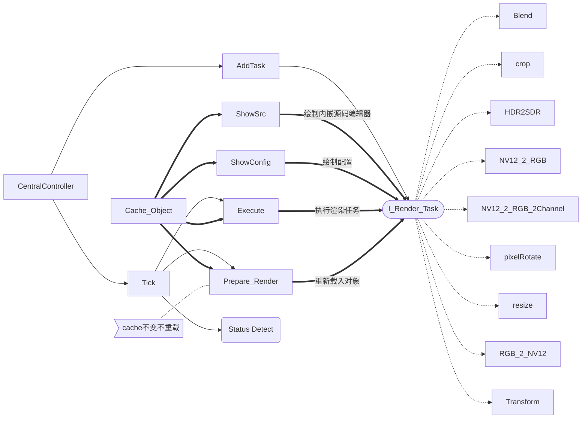

# 

[https://mermaid-js.github.io/mermaid/syntax/flowchart.html](https://mermaid-js.github.io/mermaid/syntax/flowchart.html)

```text


```



```mermaid
flowchart LR
I([I_Render_Task]) -.-> Blend
I([I_Render_Task]) -.-> crop
I([I_Render_Task]) -.-> HDR2SDR
I([I_Render_Task]) -.-> NV12_2_RGB
I([I_Render_Task]) -.-> NV12_2_RGB_2Channel
I([I_Render_Task]) -.-> pixelRotate
I([I_Render_Task]) -.-> resize
I([I_Render_Task]) -.-> RGB_2_NV12
I([I_Render_Task]) -.-> Transform

Prepare_Render_msg>cache不变不重载]-.-Prepare_Render

Cache_Object==>Prepare_Render ==重新载入对象==>I
Cache_Object==>Execute ==执行渲染任务==>I
Cache_Object==>ShowConfig ==绘制配置==>I
Cache_Object==>ShowSrc ==绘制内嵌源码编辑器==>I

CC[CentralController]-->AddTask-->I
CC-->Tick-->Prepare_Render
Tick-->Execute
Tick-->SD(Status Detect)
```